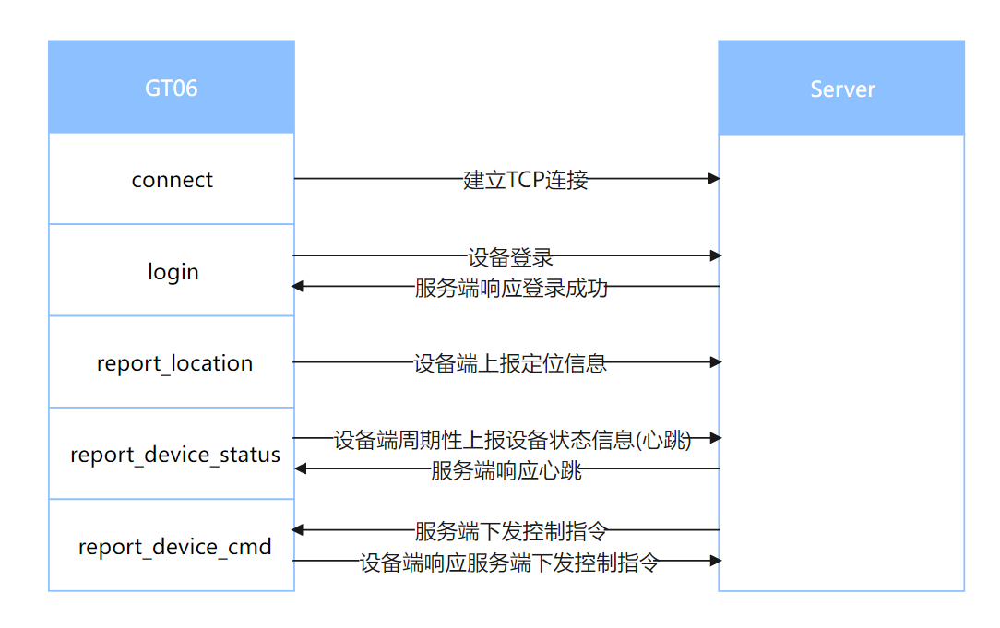

# GT06 用户指导手册

## **注意事项**

- 该项目只提供GT06协议客户端功能, 服务端需对接三方提供的服务端, 或自己搭建开源服务端进行使用。
- 该项目只提供了GT06协议基本的功能接口, 具体的使用业务需另行开发。
- 本项目只实现了GT06协议基本的消息, 服务平台定义的消息功能需进行二次开发, 服务端下行数据的数据格式由服务平台提供定义文档。
- GT06协议中要求对发送失败的数据进行存储与重发, 该项目不进行失败数据存储, 需在业务层实现失败数据的存储与重发。
- 心跳会在登录接口成功之后自动启动, 无需手动启动心跳。
- 服务端下行数据通过`set_callback`函数注册回调函数进行接收处理。

## 功能交互示意图



## 使用说明

### 1. 功能模块导入初始化

> **`ip`, `port`, `domain`根据实际对接服务环境进行替换**

```python
from usr.gt06 import GT06

ip = "127.0.0.1"
port = 8888
domain = None
timeout = 5
retry_count = 3
life_time = 180

gt06_obj = GT06(
    ip=ip, port=port, domain=domain, timeout=timeout,
    retry_count=retry_count, life_time=life_time
)
```

### 2. 设置回调函数

> - 处理服务器下发业务数据, 数据格式需根据对接的服务平台定义的规则进行处理。
> - 在参考文档时有看到有的服务端服务端指令中包含`unicode`编码的数据, 目前的QuecPython暂不支持解码, 支持`utf-8`编码格式的指令。

```python
def test_callback(args):
    protocol_no = args["protocol_no"]
    msg_no = args["msg_no"]
    content = args["content"]
    if protocol_no == 0x80:
        server_flag = content.get("server_flag")
        cmd_data = content.get("cmd_data")
        # TODO: 业务逻辑处理与消息应答, 以下为示例
        if cmd_data == "DYD,000000#":
            device_cmd = "DYD=Success!"
            global gt06_obj
            gt06_obj.report_device_cmd(server_flag, device_cmd)

set_callback_res = gt06_obj.set_callback(test_callback)
```

### 3. 设置设备状态信息

> 该步骤用于心跳信息的发送, 亦可手动调用设备信息上报接口发送, 即步骤8。

```python
defend = 1
acc = 1
charge = 0
alarm = 1
gps = 1
power = 0
voltage_level = 5
gsm_signal = 4
set_device_status_res = gt06_obj.set_device_status(
    defend, acc, charge, alarm, gps, power, voltage_level, gsm_signal
)
```

### 4. 连接服务器

> 该连接功能会进行三次重试, 当三次重试都失败后, 返回`False`, 并启动定时器, 20分钟后设备自动重启, 在此期间, 用户可重复调用该接口, 当连接成功时, 则取消重启定时任务。

```python
connect_res = gt06_obj.connect()
```

### 6. 设备登录

> 以设备的IMEI号做为设备的唯一ID进行登录, 需要先在服务端录入设备的IMEI号才可登录成功。

```python
import modem

imei = modem.getDevImei()
login_res = gt06_obj.login(imei)
```

### 7. 上报设备定位信息

> 该接口可同步上报设备状态信息, 如需同步上报设备状态信息, 先执行步骤3, 再直接设置`include_device_status`参数值为`True`即可。

```python
import net
import utime

date_time = ("{:0>2d}" * 6).format(*now_time[:6])[2:]
satellite_num = 12
latitude = 31.824845156501
longitude = 117.24091089413
speed = 120
course = 126
lat_ns = 1
lon_ew = 0
gps_onoff = 1
is_real_time = 1
mcc = net.getServingMcc()
mnc = net.getServingMnc()
lac = net.getServingLac()
cell_id = net.getServingCi()
include_device_status = False

gt06_obj.report_location(
    date_time, satellite_num, latitude, longitude, speed,
    course, lat_ns, lon_ew, gps_onoff, is_real_time,
    mcc, mnc, lac, cell_id, include_device_status
)
```

### 8. 上报设备状态信息

> - 该消息亦为心跳消息, 每三分钟会自动发送一次, 建议用户可以定时调用步骤3进行设备状态的更新, 或是做一个触发函数, 当设备状态更新时触发更新;
> - 该接口也可手动调用上报设备状态, 但是在上报之前需确认设备状态是否有变化, 建议上报之前调用步骤3进行设备状态更新。

```python
gt06_obj.report_device_status()
```
